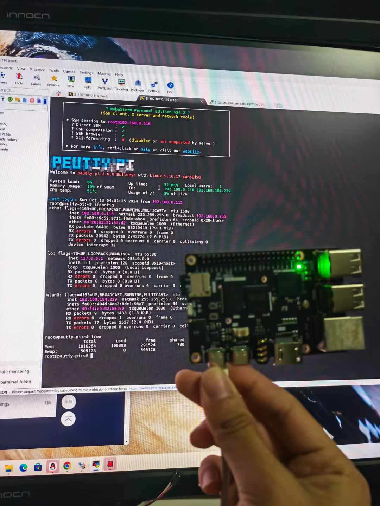
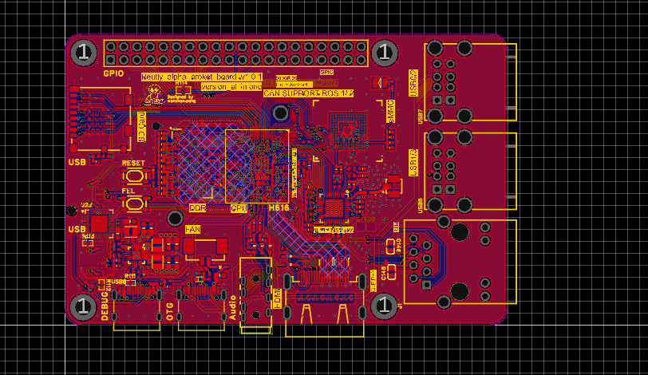

# Peutiy-Pi (菩提派)

基于全志 H616 的自制 Linux 开发板，从零构建主线 Linux 系统。
基于 Buildroot + 主线 U-Boot + 主线 Linux 内核，完全脱离芯片厂 BSP。

## 硬件

- **SoC**: 全志 H616 (Quad-core Cortex-A53 @ 1.5GHz)
- **开发板**: Peutiy-Pi（菩提派），兼容 Orange Pi Zero2 设计
- **PCB**: 自制六层板
- **电源管理**: AXP305
- **存储**: MicroSD + SPI NOR Flash
- **网络**: 千兆以太网 + WiFi (RTL8723DS / XR829)

### 显示输出

| 接口 | 状态 | 说明 |
|------|------|------|
| HDMI | ✅ 支持 | DRM 框架，最大 4K@30Hz |
| ST7789 1.47" LCD | ✅ 支持 | SPI1 接口，172×320，可用于无显示器时应急操作 |

**HDMI 和 ST7789 双显共存**：系统启动后两个显示设备同时注册 (`/dev/fb0` 和 `/dev/fb1`)，可通过 `con2fbmap` 在运行时切换 console 输出：

```bash
# 切换到 ST7789
con2fbmap 1 1

# 切回 HDMI
con2fbmap 1 0

# 查看显示状态
cat /sys/class/drm/card0-HDMI-A-1/status
```

### ST7789 接线 (Orange Pi Zero2 40pin 排针)

| ST7789 | 排针号 | GPIO |
|--------|--------|------|
| GND | 6/20/25 等 | GND |
| VCC | 1/17 | 3.3V |
| SCL | 29 | PH6 (SPI1_CLK) |
| SDA | 31 | PH7 (SPI1_MOSI) |
| RES (MISO) | 33 | PH8 (SPI1_MISO) |
| CS | 27 | PH5 (SPI1_CS0) |
| DC | 22 | PG6 |
| RST | 16 | PG7 |
| BL | 3.3V 或 GPIO | 背光，可直接接 3.3V |




## 构建环境

本项目使用 Docker 构建，隔离环境依赖。

### 构建产物

| 组件 | 版本 | 说明 |
|------|------|------|
| ARM Trusted Firmware | mainline master | BL31 |
| U-Boot | 2024.01 | Bootloader |
| Linux Kernel | 6.0.19 | 主线内核 |
| Buildroot | 2022.02.5 | 根文件系统 |

## 快速开始

### 1. 构建 Docker 镜像

```bash
# 如有代理（可选）
export https_proxy=http://127.0.0.1:7897
export http_proxy=http://127.0.0.1:7897
export all_proxy=socks5://127.0.0.1:7897

# 构建
docker build --network=host -t h616_core_build .
```

### 2. 运行容器并编译

```bash
docker run -dit --net=host \
  --hostname peutity-pi \
  -v $(pwd)/out:/out \
  -v /dev:/dev \
  --privileged=true \
  --name=h616_core_build \
  h616_core_build
```

编译完成后，产物在 `out/` 目录：

```
out/
├── uboot/u-boot-sunxi-with-spl.bin   # U-Boot 镜像
├── image/Image                        # 内核镜像
├── dtb/sun50i-h616-orangepi-zero2.dtb # 设备树
├── bootscr/boot.scr                   # U-Boot 启动脚本
└── rootfs/rootfs.tar                  # 根文件系统
```

### 3. 烧录 SD 卡

```bash
# 设置目标 SD 卡设备（⚠️ 请确认正确设备，不要覆盖系统盘！）
export sdcard=sdc

# 写入 U-Boot
dd if=./out/uboot/u-boot-sunxi-with-spl.bin of=/dev/$sdcard bs=8K seek=1

# 如果还没分区，先分区：
#   分区1: FAT32, 起始扇区 40960 (预留 20MB 给 U-Boot), 大小 128MB
#   分区2: ext4, 剩余空间全部分配

# 挂载并写入启动文件
mount /dev/${sdcard}1 /mnt/boot/
cp ./out/image/Image /mnt/boot/
cp ./out/dtb/sun50i-h616-orangepi-zero2.dtb /mnt/boot/
umount /mnt/boot

# 写入根文件系统
mount /dev/${sdcard}2 /mnt/rootfs/
tar -xvf ./out/rootfs/rootfs.tar -C /mnt/rootfs
rm /mnt/rootfs/rootfs.tar
umount /mnt/rootfs
```

### 4. 制作 SD 卡镜像 (.img)

如果你的系统不需要烧录到物理 SD 卡，可以直接制作 `.img` 镜像文件：

```bash
# 创建 2GB 空镜像
dd if=/dev/zero of=sdcard.img bs=1M count=2048

# 分区
#   分区1: 起始扇区 40960, 大小 128MB (用于 boot)
#   分区2: 起始扇区 303104, 剩余空间 (用于 rootfs)
fdisk sdcard.img << EOF
n
p
1
40960
303104
n
p
2
303106

w
EOF

# 关联 loop 设备
losetup -f sdcard.img                              # 如 /dev/loop11
losetup -f -o 20971520 --sizelimit 134742016 sdcard.img   # 分区1
losetup -f -o 155189248 --sizelimit 1992293888 sdcard.img # 分区2

# 格式化
mkfs.fat /dev/loopX   # 分区1
mkfs.ext4 /dev/loopY  # 分区2

# 写入 U-Boot
dd if=./out/uboot/u-boot-sunxi-with-spl.bin of=/dev/loop11 bs=8K seek=1

# 挂载并写入启动文件
mount /dev/loopX /mnt/boot/
cp ./out/image/Image /mnt/boot/
cp ./out/dtb/sun50i-h616-orangepi-zero2.dtb /mnt/boot/
cp ./out/bootscr/boot.scr /mnt/boot/
umount /mnt/boot

# 写入根文件系统
mount /dev/loopY /mnt/rootfs/
tar -xvf ./out/rootfs/rootfs.tar -C /mnt/rootfs
# 安装内核模块
make -C linux-6.0.19 ARCH=arm64 CROSS_COMPILE=aarch64-linux-gnu- \
  INSTALL_MOD_PATH=/mnt/rootfs/ modules_install
umount /mnt/rootfs

# 清理 loop 设备
losetup -d /dev/loopX
losetup -d /dev/loopY
losetup -d /dev/loop11

# 烧录镜像到 SD 卡
dd if=sdcard.img of=/dev/sdc bs=4M status=progress
```

## Boot 流程

```
BROM → SPL → ATF (BL31) → U-Boot → Linux Kernel → Buildroot RootFS
```

U-Boot 启动参数 (`boot.cmd` → `boot.scr`)：

```
bootargs: console=ttyS0,115200 root=/dev/mmcblk0p2 rootfstype=ext4 rootwait rw init=/sbin/init
bootcmd:  fatload mmc 0:1 0x40200000 Image
          fatload mmc 0:1 0x4fa00000 sun50i-h616-orangepi-zero2.dtb
          booti 0x40200000 - 0x4fa00000
```

## 调试

```
# 串口: UART0 (PH0=TX, PH1=RX), 115200 8N1
# 首次启动建议通过串口观察，串口输出为默认控制台
screen /dev/ttyUSB0 115200

# HDMI 显示测试
fbtest --fb /dev/fb0

# ST7789 显示测试
fbtest --fb /dev/fb1
fbterm --font-size=16
```

## 项目结构

```
├── buildroot.config               # Buildroot 基础配置
├── buildroot_finally_config       # Buildroot 最终配置
├── linux_main_menuconfig          # Linux 内核配置
├── main_sun50i-h616-orangepi-zero2.dts  # 设备树源文件
├── boot.cmd                       # U-Boot 启动脚本
├── dockerfile                     # Docker 构建文件
├── build.sh                       # Docker 构建脚本
├── auto_write.sh                  # SD 卡自动烧录脚本
├── entrypoint.sh                  # 构建产物提取脚本
├── uboot_config                   # U-Boot 配置
├── dram_sun50i_h616.c             # U-Boot DRAM 初始化
├── axp305.c                       # U-Boot AXP305 PMIC 驱动
├── fixbug/                        # 驱动修复补丁
├── picture/                       # 项目图片
└── sdcard_make/                   # SD 卡制作脚本
    ├── make_image.sh              # 制作 SD 卡镜像
    ├── make_qidongpan.sh          # 制作启动盘
    ├── shuaxie.sh                 # 刷写脚本
    ├── auto_clear.sh              # 自动清除分区
    ├── first.sh                   # 首次分区创建
    ├── loop.sh                    # Loop 设备关联
    └── finnally.sh                # 最终根文件系统替换
```
